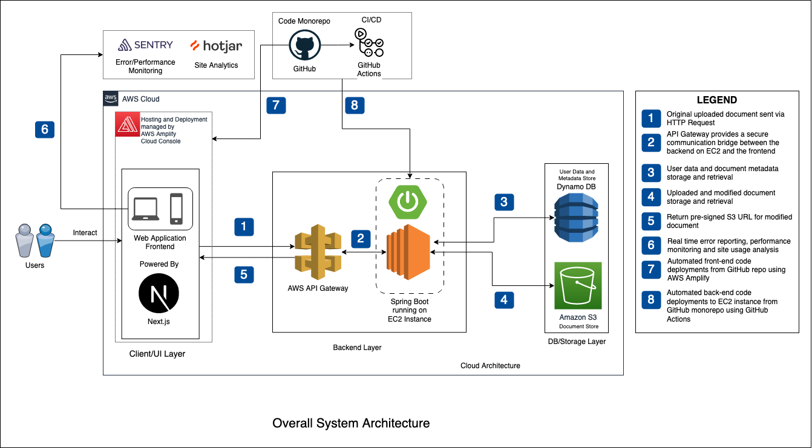

# MSc Final Project Group 3: The Accessibilator

## About the Project

Accessibilator is a web application designed to enhance the accessibility of various document formats. The application aims to make documents easier to read and understand, particularly for individuals with dyslexia and other reading difficulties. It was developed to fulfill the requirements for MSc. Computer Science at TU Dublin.

## The Accessibilator Final Demo Video

## Features

- Document Upload: Supports Word (.docx) file format.
- Document Parsing: Scans through the document for accessibility issues.
- Font and Layout Adjustments: Changes font style, size, and layout based on user needs.
- Machine Learning/NLP: Utilizes ML/NLP techniques for tasks like header generation, sentence chunking, image labeling, and glossary auto-generation.
- User Interface: Provides a highly accessible and user-friendly interface

## System Architecture

## Technologies

Front-end: Next.js, TailwindCSS, and Headless UI
Back-end: Java with Spring Boot, Apache POI, AWS Eventbridge
Database: Amazon DynamoDB
Hosting: AWS Amplify
Storage: AWS S3
Machine Learning: Python, Ollama.ai, AWS SageMaker,
